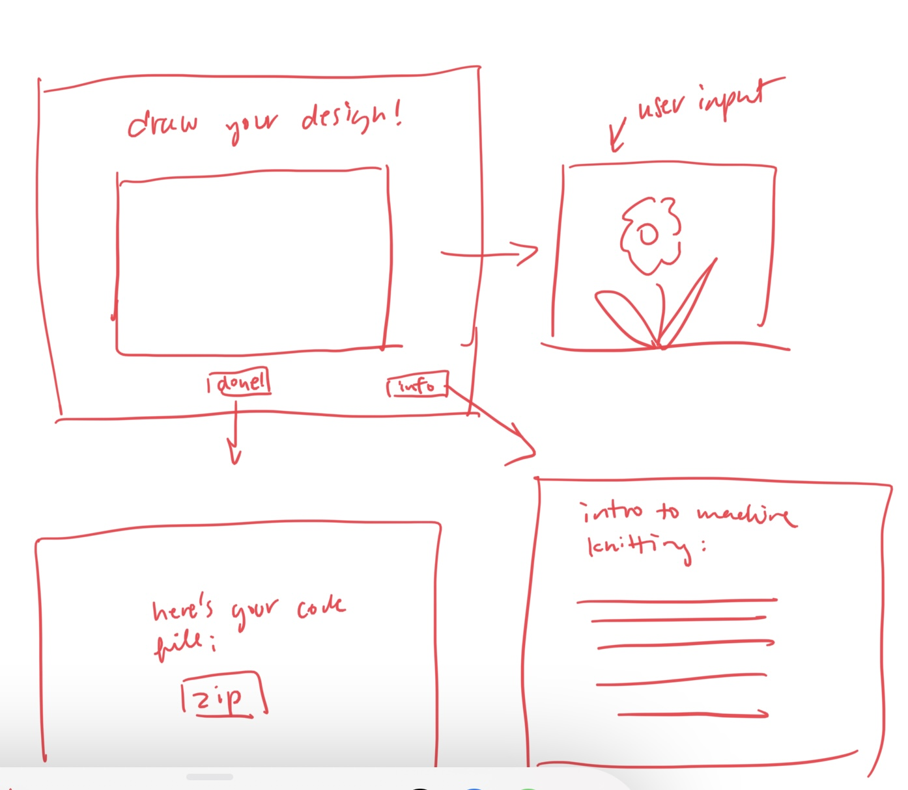

<mark>**Note that this document order from FP4 -> FP1**</mark>

<mark>Please sign up for the study</mark> at [https://tinyurl.com/pui-study](https://tinyurl.com/pui-study) to allow us to use your submission to create a better GenAI assistant for designers!

---

# **FP4 \- Final Project Writeup**

Feel free to refer to this [Markdown Cheat Sheet](https://www.markdownguide.org/cheat-sheet/) to make your writeup more organized, and you can preview your markdown file in VSCode [Markdown editing with Visual Studio Code](https://code.visualstudio.com/docs/languages/markdown#_markdown-preview). 

## Part 1: Website Description

Describe your website (300 words).

* What is the purpose of your website?  
The website is a collaborative project where I visualizaed the poem "How Small the Beetles Run" by Emma Li. Inspired by alternate reality games (ARGs), poem visualizations, and digital installations, it explores how electronic media and creative coding can elevate texts into a fuller sensory experience. I wanted to bridge my visual language with frontend development and this project was an really interesting try at blending interactivity, visuals, and interface design/development.

* Who is the target audience? 
This project is best aimed at individuals who are interested the intersection of art, technology, and storytelling. I hope everyone can have moments of interest and delight with it, but I think it'll espeically appeal to digital artists, writers, and creative coding developers.

* What information do you convey with your website?   
The project highlights how technology can turn something as static as a poem into a dynamic, living artwork. By using interactivity, animations, and visuals, the website reflects my visual interpretation of "How Small the Beetles Run". I want to convey a dynamic and engaging experience to viewers and add another dimension to the poem. 

* How is it interesting and engaging? 
The website is engaging because it rewards curiosity and interaction. As viewers explores the interface, they uncover animations, shifting visuals, and hidden layers that evolve with their actions. It’s an immersive, game-like experience where the poem unfolds gradually, creating moments of surprise and discovery. By combining art and technology, this project transforms poetry into a multisensory experience that feels interactive, exploratory, and alive.

## Part 2: User Interaction

How a user would interact with your website? For each step, briefly but clearly state the interaction type & how we should reproduce it.

1. Click on title page (title.html) for credits
2. Click again to be taken to the main poem page
3. Mousedown anywhere begins music
4. Drag on the word "I" anywhere on the page and release to see the full phrase and unlock 2nd one. 
5. Click on the purple "blackberry bush" to reveal an image of a bush. 
6. Release "and the berries" for blackberry visuals to appear.
7. Click on "Dye our feet purple" for the black berries to become smushed.
8. Release "Pebbles are springs beneath our feet" for a spring video to appear. 
9. Release "beetle move" for beetles to appear.
10. Click on "move" for beetles to move along the bottom of the page.
11. Click on "....." to navigate to ending page. 
12. Hover on ending texts for text animation.

## Part 3: External Tool

Describe what important external tool you used (JavaScript library, Web API, animations, or other). Following the bulleted list format below, reply to each of the prompts.

1. Animate.css and jQuery
  * Why did you choose to use it over other alternatives? (2 sentences max)  
    After researching some text animations, I decided I like the effects of the hinge animation and thus chose these libraries.
  * How you used it? (2 sentences max)  
      I used it in the last page of my project to create a text animation. 

  * What does it add to your website? (2 sentences max) 
    It adds interest and dramatic effect for a finale and makes the project more memorable. 

## Part 4: Design Iteration

Describe how you iterated on your prototypes, if at all, including any changes you made to your original design while you were implementing your website and the rationale for the changes. (4-8 sentences max)

1. Originally I wanted a signle page application. However, I ran into a series of implementation difficulties with saving the changes and clearing certain changes. Furthermore, pacing was a consistent issue and I wanted there to be more anticipation to the user interactions. Therefore, 3 diffreent pages wre implemented instad.
2. On the design side, balancing the pacing of the poem with the interactivity was tricky. I tested the site with users to understand how to keep them engaged with both the visuals and the poem itself. Based on their feedback, I adjusted the music, staggered the appearance of text, reduced background opacity to increase contrast, and scaled down visual elements. These changes helped create a more immersive experience without being too distracting.

## Part 5: Implementation Challenge

What challenges did you experience in implementing your website? (2-4 sentences max)

Organizing my code and designing algorithms required a lot of trial and error--— deciding where to specify actions and specific use cases, took time to streamline. While there were a lot of ways to implement and make work the action wanted, I had to think a lot about how to make the code be most orgagnized and elegant for me to maintain and others to understand. Additionally, navigating the complexity of interactions was a major challenge, especially since they are often onthe same element, animations would interefere with each other. 

## Part 6: Generative AI Use and Reflection

Describe how you used Generative AI tools to create this final project (fill in the following information, write \~500 words in total).

Document your use of all GenAI tools — ChatGPT, Copilot, Claude, Cursor, etc. using the template below. Add/Delete rows or bullet points if needed, and replace Tool1/Tool2 with the name of the tool.

### Usage Experiences by Project Aspects

Feel free to edit the column \_ (other?) or add more columns if there's any other aspect in your project you've used the GenAI tools for.

For the following aspects of your project, edit the corresponding table cell to answer:
- *Usage*: Whether you used / did not use this tool for the aspect. Enter [Yes/No]
- *Productivity*: Give a rating on whether this tool makes your productivity for X aspect [1-Much Reduced, 2-Reduced, 3-Slightly Reduced, 4-Not Reduced nor Improved, 5-Slightly Improved, 6-Improved, 7-Much Improved].

| Tool Name | Ratings | design | plan | write code | debug | \_ (other?) |
| :---- | :---- | :---- | :---- | :---- | :---- | :---- |
| ChatGPT | Usage | No | Yes | Yes | Yes| No |
| ChatGPT | Productivity | X | 2 | 5 | 7 | X |

### Usage Reflection

> Impact on your design and plan 
* It matched my expectations and plan in [FP2](#generative-ai-use-plan) in that … For example, 
  1. ChatGPT: It was great for debugging. While it was not always helpful, it caught many of the errors that I could have caught myself but would've spent much longer to do so. It was able to spot the most obvious errors such as wrong file names, that often are the most looked over in my debugging.
  2. ChatGPT: It was also not reliable for interface and algorithm design. I did ask for help but did not find most of the design and implementation suggestions it gave helpful at all. 
* It did not match my expectations and plan in [FP2](#generative-ai-use-plan) in that … For example, 
  1. ChatGPT: I was not able to generate decent visual elements that matched what I was going for and gave it as prompts. As a result I had to make a lot of them before working on interactions, as the visuals and interactions felt like they depended on each other.
  2. ChatGPT: It was also not helpful for slightly more complex implementations, and I ultimately had to dig on Youtube and StackOverflow for interactions such as my drag and release interaction. 
* GenAI tool did not influence my final design and implementation plan because … For example, 
  1. ChatGPT: While it helped my implementation, (as discussed above) it was not really reliable for any higher level decision making and I made  all of my high level decisions independently while it helped with the details of my implementation. 

> Use patterns
* I accepted the generations when …  For example, 
  1. ChatPT: GPT often suggested new classes in CSS that I didn't think about or ask it about, such as overflow handling, that I kept because it made my code more error-proof and was a good addition. 
* I critiqued/evaluated the generated suggestions by … For example, 
  1. ChatGPT once suggested to edit my code to be cleaner and in good style by breaking down the code down to be as clean as possible. However, I rejected this suggestion as it made the code less readable and made less sense. I organized it myself according to each case as I had it before. Even though this was more lines of code, it was easier to read and understand.
  

> Pros and cons of using GenAI tools
* Pros
  1. ChatGPT: Efficiency increase. For example, I was able to tell it to add e.preventDefault() everywhere I needed to without combing through over 300 lines of code myself. Use cases as such saves me a lot of time and energy throughout the project.
  2. ChatGPT: Great learning tool. Instead of searching through multiple YouTube and StackOverflow pages trying to figure out what I need to do, I'd say 75% of the time I'm able to just ask GPT and be able to know what I need to do. Additionally, if I don't understand a part of it, I can directly ask it to explain it to me. 
* Cons
  1. ChatGPT: I'm learning less in detail than I used to prior to GenAI. I definitely still need to understand and design myself the bigger picture and architecture of my code, and need know enough to judge whether GPT's output is wrong or right. However, I no longer need to be familiar with the details of exact implementations if I dont want to be. I don't need to memorize what padding vs margin is or write myself a cheat sheet. I don't  consider my learning to be more shallow than before but definitely details are lost as a tradeoff to efficiency.  

### Usage Log

Document the usage logs (prompts and chat history links) for the GenAI tools you used. Some tools may not have an easy way to share usage logs, just try your best! Some instructions for different tools:

1. [ChatGPT](https://help.openai.com/en/articles/7925741-chatgpt-shared-links-faq) / [Gemini](https://support.google.com/gemini/answer/13743730?hl=en&co=GENIE.Platform%3DDesktop): share the anonymous link to all of your chat histories relevant to this project

- https://chatgpt.com/share/6760d04b-7088-8009-94cb-4f43af592276 

## Appendix

#### title page (index.html):

#### game page (stanza.html):

#### end page (finis.html):

# **FP3 \- Final Project Check-in**

Document the changes and progress of your project. How have you followed or changed your implementation & GenAI use plan and why? Remember to commit your code to save your progress.

## Implementation Plan Updates

- Key update include implementing only 2 stanzas in order to focus on increasing quality and number of interactions.

## Generative AI Use Plan Updates

- Nothing has changed.

Remember to keep track of your prompts and usage for [FP4 writeup](#part-6-generative-ai-use-and-reflection).

---

# **FP2 \- Evaluation of the Final project**

## Project Description

My chosen idea will be a collaboration between me and a friend, Emma Li, where I create an interactive playthrough/visualization of part 1 of her poem "How Small the Beetles Run". The design will feature different visual representations of the poem, the poem itself, that are interactive for the user through screen actions such as clicking, hovering, dragging, and scrolling.

## High-Fi Prototypes

### *Prototype 1*

This prototype is a full screen format of the visualization. The phrases stay until two stanzas fill the page, and then disappear and a cleared pageg appears for the new section of the poem. This prototype received the best feedback from the users, who thought it made the narrative more interesting and exciting, as they weren't sure what will pop up next. One criticism was that users are unsure of what to do in the beginning, while most users quickly realized the interactivity, users reproted the constant switching of interactions was distracting and suggested keeping them more limited. 

### *Prototype 2*

This prototype is similar to the first, except that there are four sections, each for a stanza of the poem. This way, users begin a new box for each stanza and will have a finished visualization for each stanza to look at by the end of the experience. While I thought users would like the finished product, both users surprisngly found the tighter space feeling more constrained, and that made the popped up graphics and interactions less surprising and delightful. One user that the structure made it feel more constrained and less interesting to her.

## Usability Test

Discuss the user feedback you got during the evaluation / usability test (\~300 words). Indicate which feedback you implemented, inspired new directions, or otherwise influenced your final design. 

During usability testing, users provided insightful feedback on both prototypes. Prototype 1 featured a full-screen format where phrases stayed until two stanzas filled the page, then disappeared as a cleared page appeared for the next poem section. Users liked this format, noting that it made the narrative more engaging since they weren’t sure what would appear next. However, a common criticism was the uncertainty in how to start; while most users discovered the interactivity quickly, some felt the changing interactions were distracting and recommended limiting them for consistency.

Prototype 2 differed by dividing the experience into four sections, one for each stanza, which provided a separate visualization space for each. I initially thought users would appreciate the completed look of each stanza, but feedback revealed the opposite. Both users felt the confined space limited the impact of the visuals and made the interactions feel predictable, ultimately reducing the spontaneity and excitement they experienced in Prototype 1. One user even commented that the structured layout felt constrained and less engaging.

In response to this feedback, I implemented several changes. I retained the full-screen design from Prototype 1, as users found it enhanced the narrative flow and surprise elements. To address the start-point ambiguity, I changed the initial interaction to allow users to click anywhere on the screen instead of on the title, signaling interactivity without explicit prompts. I chose not to add a “click here” label, as it disrupted the artistic flow and exploration element, which is essential for this art-focused project. Instead, the starting interaction is more subtle, balancing user guidance with room for exploration. 

## Updated Designs

Show screenshots of your updated design based on the user feedback (\<100 words, \~2 images).

The key implementation of user feedback is that the first interaction now starts with clicking anywhere on the screen rather than clicking on the title, which indicates to users the interactive nature of the experience. While I contemplated adding a label e.g. "click here", it ultimately was too disruptive to the overall narration, and given the webpage is purposed as an art project I beleive its ok that there are more rooms for ambuiguity and exploration, rather than entirely prioritizing user efficiency and ease, as long as its not distressful to the user. Interaction happening from clicking anywhere on the screen was the compromise I settled on that ensures the user understands how to proceed forward fairly quickly without being too "on the nose" and instructive.

## Feedback Summary

Summarize the feedback you received in the lab session and discuss how it influenced your design (\~300 words). 

Note that the interactions will be more elaborate and involve more details in my actual project, but prototyping every detail felt unproductive. I focused on prototyping enough so users could grasp the bigger picture and get a sense of how microinteractions with the poem phases will work.

While I was unable to gather feedback in lab, I sought out one more classmate’s input to gain further insights. She largely agreed with prior feedback on the second prototype, noting that while it was nice to see the full picture of each stanza, it felt more restrictive and detracted from the whimsical mood I aim to create. She was also the one who argued against adding conspicuous labels, suggesting instead that a bit of search time was worth it if the exploration experience was fun and engaging. This feedback prompted me to think about how I could enhance the experience from the very start and led me to incorporate sound and visual imagery. I believe adding sound will further enhance the whimsical and immersive nature of the piece, helping users feel more engaged. I also decided to make interactions more fluid, using more delays and soft appearances and will look into libraries further to explore animation possibilities, to maintain a sense of mystery and excitement, encouraging users to feel a sense of discovery. Overall, user feedback highlighted the importance of balancing intuitiveness with creative exploration, inspiring me to simplify interactions and preserve the spontaneous quality that users enjoyed. This will allow for a richer, more dynamic experience.

## Milestones

Outline weekly milestones to plan your expected implementation progress until the end of the semester (\~300 words). 

### *Implementation Plan*

- [ ] Week 9 Oct 28 \- Nov 1:
  - [X] FP1 due
  
- [ ] Week 10 Nov 4 \- Nov 8:   
  - [X] FP2 due

- [ ] Week 11 Nov 11 \- Nov 15: 
  - [ ] Research how to use library
  - [ ] Stanza 1 and 2 content gathered
  - [ ] Stanza 1 animations implemented
- [ ] Week 12 Nov 18 \- Nov 22:  
  - [ ] Stanza 3 and 4 content gathered
  - [ ] Stanza 2 animations implemented
- [ ] Week 13 Nov 25 \- Nov 29:  
  - [ ] Thanksgiving  
  - [ ] Stanza 3 animations implemented
- [ ] Week 14 Dec 2 \- Dec 6:  
  - [ ] Stanza 4 animations implemented
  - [ ] User testing final design
  - [ ] FP4 due 

### *Libraries and Other Components*

List the JS libraries and other components (if applicable) that you plan to use. 
* D3 Library for interactive animations

## Generative AI Use Plan

I mostly use ChatGPT and will outline below the ways I plan to use and not use it on this project. 

### *Tool Use*

* ChatGPT  
  * I will use it to debug issues with interactions because it can potentially spot easy-to-miss bugs (such as typos and misnamed file names) that I might have missed.
  * I will not rely on it for detailed design and animation implementation, as some concepts may be too specific or require deeper customization beyond general guidance that it can give me.
  * I will not use it to come up with my ideas for visuals and interaction elements, as this will limit my originality and creativity on the project.
  * I will use it to brainstorm visual ideas for the interactive elements because I can starting working out animations and interactions this way before I gather all my content.  

### *Responsible Use*

I’ll use Generative AI tools responsibly by verifying the accuracy of generated suggestions, adapting them to fit my unique project needs. I will also be ensuring that my work is original and aligned with ethical use practices.

# **FP1 \- Proposal for Critique**

## Idea Sketches

### *Interactive/animated poetry visual narrative*

My idea is to create an interactive readthrough/narrative of a chosen poem. The design will feature different visual representations of the poem, as well as the actual poem itself, that are interactive for the reader through actions such as clicking, hovering, dragging, and scrolling. I want this to be more an web-based art project that I can include in my art portfolio, so I want to enhance and convey the chosen narrative through visuals, sound, interactions, and animations.

To ensure accessibility, I'll make sure to provide alt-texts for all visuals so that it's compatible with screen readers. I'll also make sure interactions can be navigated in a logical manner using Tab. While colors will be an important part of the design, I'll also make sure to use patterns and shapes to differentiate elements.

### *Machine knitting designer/visualizer*

This idea aims to create an web interface that allows a user to draw out a 2 color design and then convert it to Knitout code, which allows it to be knitted out in a double knit on standard knitting machines. The main component of this will be a user drawing box, where users can draw their own design. The application then convert this into Knitout code, which can be then downloaded and ran by knittting machines.

To ensure accessibility, I'll make sure the page is navigatable by Tab key. I'll also include a how to instruction page with introductions and explanations on machine knitting, Knitout, and the double knit. Lastly, I'll also use high contrast colors to ensure the page is accessible to visually impaired users.

### *Trinket Galore*

My third idea is a web based game inspired by ones such as Rat Shrine [Rat Shrine](https://xrafstar.monster/games/twine/shrine/), where anonymous users can submit their trinkets, knickknacks, and general objects of affection. They'd then be morphed together into a singular collective 3d trinket sculpture/shrine in the palace. Potentially other features will be to trade trinkets with other users, and to spin the 3D model to view and find your own. 

To ensure accessibility, I'll make sure the page is navigable by Tab key. I'll also use high contrast colors and offer alt texts to all visuals to ensure screen reader combatibility.

## Feedback Summary
Summarize all the critiques you received during the lab session (\~300 words). 

My first idea received the most interest. People thought that it was interesting and would fit nicely in my art portfolio. It'll be very interaction and animation heavy, which would be a good exercise of my web development skills. The critique I received was on the complexity level and that a poem would not have enough complexities. Some ideas others gave me is to add multiple poems or allow for user input of poems, or to make sure the complexity and number of interactions was sufficient.

The second idea has a good bit of technical potential. People found it unique and thought it showcases both web development and design skills, and my personal interest in textiles and machine knitting. One area of concern was the technical difficulty. This would require figuring out an algorithm to translate visuals to knitout code on the backend and take a lot of energy away from practicing frontend web development. Another was on the drawing interface for users, and considering what interaction feedbacks there would be to users to ensure that it’s responsive and user-friendly. Another suggestion was to add a preview feature for how the Knitout design would look when knitted, which could help users feel more confident in their creations.

The third idea is mostly received critique on complexity issues that need addressing. One major concern is the backend infrastructure and how the website will efficiently track and store user inputs. Developing a robust database might introduce challenges, making it crucial to simplify the scope to avoid bugs and ensure a smooth experience. Additionally, there’s the technical question of morphing 2D submissions into 3D shapes. While some loss of detail may be acceptable, it’s uncertain how this will affect the final aesthetic of the trinket sculpture. Overall, these complexities could impact the project's feasibility.

## Feedback Digestion
Digest the feedback you got in the lab (\~300 words). Indicate which critique you will act on in your next design and why you chose to incorporate/dismiss pieces of critique.

For my first idea, which focuses on creating an interactive poem experience, I received valuable feedback suggesting enhancements for complexity. Initially, I considered incorporating multiple poems to enrich the narrative, but I decided against this, as I want to customize the visuals and interactive elements specific to each poem, and ensuring that the complexity of the narrative itself is sufficient to engage users. I will also ensure that the interactions are diverse, providing various ways for users to connect with the text visually and audibly. This focused approach will help create a more impactful experience.

The second idea involves developing a web interface for designing patterns that convert to Knitout code. The feedback highlighted the need for a user-friendly drawing interface and meaningful interaction feedback. To address this, I will prioritize designing a responsive interface that provides clear feedback during user interactions likely through using an microinteraction library. Additionally, I’ll incorporate a preview feature that allows users to visualize their designs before finalizing them. While the idea showcases my interest in textiles, I must ensure that the technical aspects do not overwhelm and I end up with a less sophisticated interface and user experience.

The third idea, centered around a web-based game for submitting and morphing trinkets, faced significant critiques regarding complexity. The primary concerns revolved around backend infrastructure and the challenge of morphing 2D to 3D models. After careful consideration, I’ve decided against this idea, as the backend complexity could detract from creating a smooth user experience. Instead, I will redirect my efforts toward the one of the two ideas, where I can focus on frontend development and interactivity. This decision will allow me to concentrate on projects that enhance my skills while ensuring a more seamless and engaging user experience.
