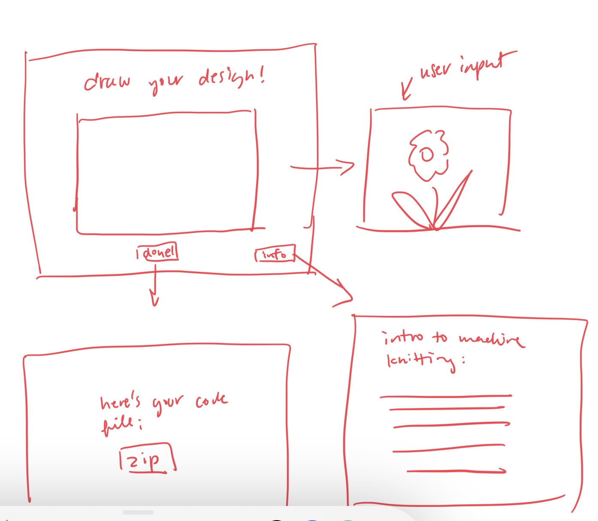
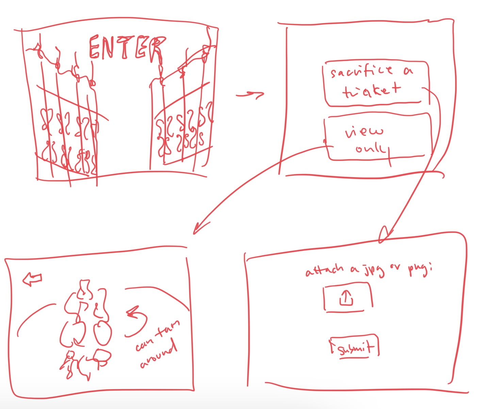

<mark>**Note that this document order from FP4 -> FP1**</mark>

<mark>Please sign up for the study</mark> at [https://tinyurl.com/pui-study](https://tinyurl.com/pui-study) to allow us to use your submission to create a better GenAI assistant for designers!

---

# **FP4 \- Final Project Writeup**

Feel free to refer to this [Markdown Cheat Sheet](https://www.markdownguide.org/cheat-sheet/) to make your writeup more organized, and you can preview your markdown file in VSCode [Markdown editing with Visual Studio Code](https://code.visualstudio.com/docs/languages/markdown#_markdown-preview). 

## Part 1: Website Description

Describe your website (300 words).

* What is the purpose of your website?   
* Who is the target audience?  
* What information do you convey with your website?   
* How is it interesting and engaging? 

## Part 2: User Interaction

How a user would interact with your website? For each step, briefly but clearly state the interaction type & how we should reproduce it.

1. Interaction type. Click on X on page Y / scroll on page X, etc.  
2. 

## Part 3: External Tool

Describe what important external tool you used (JavaScript library, Web API, animations, or other). Following the bulleted list format below, reply to each of the prompts.

1. Name of tool1  
   * Why did you choose to use it over other alternatives? (2 sentences max)  
   * How you used it? (2 sentences max)  
   * What does it add to your website? (2 sentences max)  
2. Name of tool2

## Part 4: Design Iteration

Describe how you iterated on your prototypes, if at all, including any changes you made to your original design while you were implementing your website and the rationale for the changes. (4-8 sentences max)

## Part 5: Implementation Challenge

What challenges did you experience in implementing your website? (2-4 sentences max)

## Part 6: Generative AI Use and Reflection

Describe how you used Generative AI tools to create this final project (fill in the following information, write \~500 words in total).

Document your use of all GenAI tools — ChatGPT, Copilot, Claude, Cursor, etc. using the template below. Add/Delete rows or bullet points if needed, and replace Tool1/Tool2 with the name of the tool.

### Usage Experiences by Project Aspects

Feel free to edit the column \_ (other?) or add more columns if there's any other aspect in your project you've used the GenAI tools for.

For the following aspects of your project, edit the corresponding table cell to answer:
- *Usage*: Whether you used / did not use this tool for the aspect. Enter [Yes/No]
- *Productivity*: Give a rating on whether this tool makes your productivity for X aspect [1-Much Reduced, 2-Reduced, 3-Slightly Reduced, 4-Not Reduced nor Improved, 5-Slightly Improved, 6-Improved, 7-Much Improved].

| Tool Name | Ratings | design | plan | write code | debug | \_ (other?) |
| :---- | :---- | :---- | :---- | :---- | :---- | :---- |
| Tool1 | Usage | Yes/No | Yes/No | Yes/No | Yes/No | Yes/No |
| Tool1 | Productivity | 1~7 | 1~7 | 1~7 | 1~7 | 1~7 |
| Tool2| Usage | Yes/No | Yes/No | Yes/No | Yes/No | Yes/No |
| Tool2 | Productivity | 1~7 | 1~7 | 1~7 | 1~7 | 1~7 |

### Usage Reflection

> Impact on your design and plan 
* It matched my expectations and plan in [FP2](#generative-ai-use-plan) in that … For example, 
  1. Tool1: 
  2. Tool2:
* It did not match my expectations and plan in [FP2](#generative-ai-use-plan) in that … For example, 
  1. Tool1: 
  2. Tool2:
* GenAI tool did/did not influence my final design and implementation plan because … For example, 
  1. Tool1: 
  2. Tool2:

> Use patterns
* I accepted the generations when …  For example, 
  1. Tool1: this tool once suggested … and I adjusted my design according to the suggestion because … 
  2. Tool2: 
* I critiqued/evaluated the generated suggestions by … For example, 
  1. Tool1: this tool once suggested … but I modified/rejected the suggestion because … 
  2. Tool2: 

> Pros and cons of using GenAI tools
* Pros
  1. Tool1: 
  2. Tool2:
* Cons
  1. Tool1: 
  2. Tool2:

### Usage Log

Document the usage logs (prompts and chat history links) for the GenAI tools you used. Some tools may not have an easy way to share usage logs, just try your best! Some instructions for different tools:

1. [ChatGPT](https://help.openai.com/en/articles/7925741-chatgpt-shared-links-faq) / [Gemini](https://support.google.com/gemini/answer/13743730?hl=en&co=GENIE.Platform%3DDesktop): share the anonymous link to all of your chat histories relevant to this project
2. [GitHub Copilot (VSCode)](https://code.visualstudio.com/docs/copilot/copilot-chat#:~:text=You%20can%20export%20all%20prompts%20and%20responses%20for%20a%20chat%20session%20in%20a%20JSON%20file%20with%20the%20Chat%3A%20Export%20Session...%20command%20(workbench.action.chat.export)%20in%20the%20Command%20Palette.): export chat histories relevant to this project.

---

# **FP3 \- Final Project Check-in**

Document the changes and progress of your project. How have you followed or changed your implementation & GenAI use plan and why? Remember to commit your code to save your progress.

## Implementation Plan Updates

- [ ] ...

## Generative AI Use Plan Updates

- [ ] ...

Remember to keep track of your prompts and usage for [FP4 writeup](#part-6-generative-ai-use-and-reflection).

---

# **FP2 \- Evaluation of the Final project**

## Project Description

Briefly restate your motivation and a short description of your project.

## High-Fi Prototypes

### *Prototype 1*

A brief description and summary of the user feedback (\<100 words, 2 images) 

### *Prototype 2*

…

## Usability Test

Discuss the user feedback you got during the evaluation / usability test (\~300 words). Indicate which feedback you implemented, inspired new directions, or otherwise influenced your final design. 

## Updated Designs

Show screenshots of your updated design based on the user feedback (\<100 words, \~2 images).

## Feedback Summary

Summarize the feedback you received in the lab session and discuss how it influenced your design (\~300 words). 

## Milestones

Outline weekly milestones to plan your expected implementation progress until the end of the semester (\~300 words). 

### *Implementation Plan*

- [ ] Week 9 Oct 28 \- Nov 1:
  - [X] FP1 due
  - [ ] ...
  
- [ ] Week 10 Nov 4 \- Nov 8:   
  - [ ] FP2 due

- [ ] Week 11 Nov 11 \- Nov 15:  
- [ ] Week 12 Nov 18 \- Nov 22:   
- [ ] Week 13 Nov 25 \- Nov 29:  

  - [ ] Thanksgiving  
- [ ] Week 14 Dec 2 \- Dec 6:  
  - [ ] FP4 due 

### *Libraries and Other Components*

List the JS libraries and other components (if applicable) that you plan to use. 
* 

## Generative AI Use Plan

Outline how you plan to use Generative AI tools to aid in the implementation (\~300 words).

### *Tool Use*

 What would you use? Edit the list given your plan. For each tool, explain briefly on what do you expect Generative AI to help you with and what might it not be able to help you with.

* ChatGPT  
  * I will use it for … because it can help me …  
  * I will not use it for … because it might not be able to help me with …   
* GitHub Copilot  
* ...

### *Responsible Use*

How would you use Generative AI responsibly? 

---

# **FP1 \- Proposal for Critique**

## Idea Sketches

### *Interactive/animated poetry visual narrative*

My idea is to create an interactive readthrough/narrative of a chosen poem. The design will feature different visual representations of the poem, as well as the actual poem itself, that are interactive for the reader through actions such as clicking, hovering, dragging, and scrolling. I want this to be more an web-based art project that I can include in my art portfolio, so I want to enhance and convey the chosen narrative through visuals, sound, interactions, and animations.

To ensure accessibility, I'll make sure to provide alt-texts for all visuals so that it's compatible with screen readers. I'll also make sure interactions can be navigated in a logical manner using Tab. While colors will be an important part of the design, I'll also make sure to use patterns and shapes to differentiate elements.

### *Machine knitting designer/visualizer*

This idea aims to create an web interface that allows a user to draw out a 2 color design and then convert it to Knitout code, which allows it to be knitted out in a double knit on standard knitting machines. The main component of this will be a user drawing box, where users can draw their own design. The application then convert this into Knitout code, which can be then downloaded and ran by knittting machines.

To ensure accessibility, I'll make sure the page is navigatable by Tab key. I'll also include a how to instruction page with introductions and explanations on machine knitting, Knitout, and the double knit. Lastly, I'll also use high contrast colors to ensure the page is accessible to visually impaired users.

### *Trinket Galore*

My third idea is a web based game inspired by ones such as Rat Shrine [Rat Shrine](https://xrafstar.monster/games/twine/shrine/), where anonymous users can submit their trinkets, knickknacks, and general objects of affection. They'd then be morphed together into a singular collective 3d trinket sculpture/shrine in the palace. Potentially other features will be to trade trinkets with other users, and to spin the 3D model to view and find your own. 

To ensure accessibility, I'll make sure the page is navigable by Tab key. I'll also use high contrast colors and offer alt texts to all visuals to ensure screen reader combatibility.

## Feedback Summary
Summarize all the critiques you received during the lab session (\~300 words). 

My first idea received the most interest. People thought that it was interesting and would fit nicely in my art portfolio. It'll be very interaction and animation heavy, which would be a good exercise of my web development skills. The critique I received was on the complexity level and that a poem would not have enough complexities. Some ideas others gave me is to add multiple poems or allow for user input of poems, or to make sure the complexity and number of interactions was sufficient.

The second idea has a good bit of technical potential. People found it unique and thought it showcases both web development and design skills, and my personal interest in textiles and machine knitting. One area of concern was the technical difficulty. This would require figuring out an algorithm to translate visuals to knitout code on the backend and take a lot of energy away from practicing frontend web development. Another was on the drawing interface for users, and considering what interaction feedbacks there would be to users to ensure that it’s responsive and user-friendly. Another suggestion was to add a preview feature for how the Knitout design would look when knitted, which could help users feel more confident in their creations.

The third idea is mostly received critique on complexity issues that need addressing. One major concern is the backend infrastructure and how the website will efficiently track and store user inputs. Developing a robust database might introduce challenges, making it crucial to simplify the scope to avoid bugs and ensure a smooth experience. Additionally, there’s the technical question of morphing 2D submissions into 3D shapes. While some loss of detail may be acceptable, it’s uncertain how this will affect the final aesthetic of the trinket sculpture. Overall, these complexities could impact the project's feasibility.

## Feedback Digestion
Digest the feedback you got in the lab (\~300 words). Indicate which critique you will act on in your next design and why you chose to incorporate/dismiss pieces of critique.

For my first idea, which focuses on creating an interactive poem experience, I received valuable feedback suggesting enhancements for complexity. Initially, I considered incorporating multiple poems to enrich the narrative, but I decided against this, as I want to customize the visuals and interactive elements specific to each poem, and ensuring that the complexity of the narrative itself is sufficient to engage users. I will also ensure that the interactions are diverse, providing various ways for users to connect with the text visually and audibly. This focused approach will help create a more impactful experience.

The second idea involves developing a web interface for designing patterns that convert to Knitout code. The feedback highlighted the need for a user-friendly drawing interface and meaningful interaction feedback. To address this, I will prioritize designing a responsive interface that provides clear feedback during user interactions likely through using an microinteraction library. Additionally, I’ll incorporate a preview feature that allows users to visualize their designs before finalizing them. While the idea showcases my interest in textiles, I must ensure that the technical aspects do not overwhelm and I end up with a less sophisticated interface and user experience.

The third idea, centered around a web-based game for submitting and morphing trinkets, faced significant critiques regarding complexity. The primary concerns revolved around backend infrastructure and the challenge of morphing 2D to 3D models. After careful consideration, I’ve decided against this idea, as the backend complexity could detract from creating a smooth user experience. Instead, I will redirect my efforts toward the one of the two ideas, where I can focus on frontend development and interactivity. This decision will allow me to concentrate on projects that enhance my skills while ensuring a more seamless and engaging user experience.
